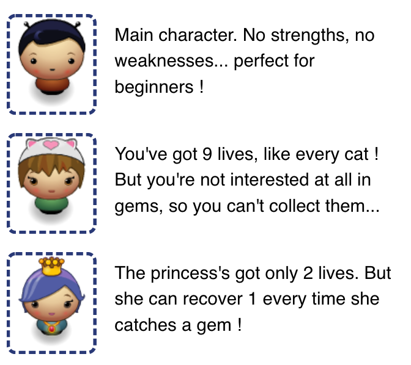
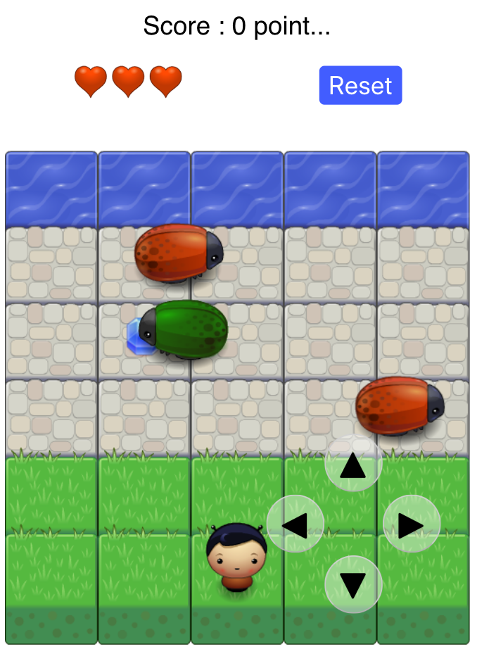

# Frogger Project

## Table of Contents

- [Launching Instructions](#launching instructions)
- [How to play](#how to play)

## Launching Instructions
You don't need to install anything if you just want to play to this game.
Simply go to [https://ralf5543.github.io/frogger/](https://ralf5543.github.io/frogger/)

## How to play
### Goal
The frogger's goal is to get the maximum points. No timer, you can play until your character dies. No need to rush !

### Characters selection
Chose one of the (actually) 3 characters. Each of them has got their own strengths and weaknesses.

### Gameplay
Use the 4 arrows of your keyboard (or your fingers on a mobile) to guide your characters to the top of the screen. Each time you do so, you get a point. Try to get extra points by picking up gems.

Avoid red and green bugs. Each time they touch you, you lose 1 life point, symbolized by a heart. When your last heart is gone, the game is over.
